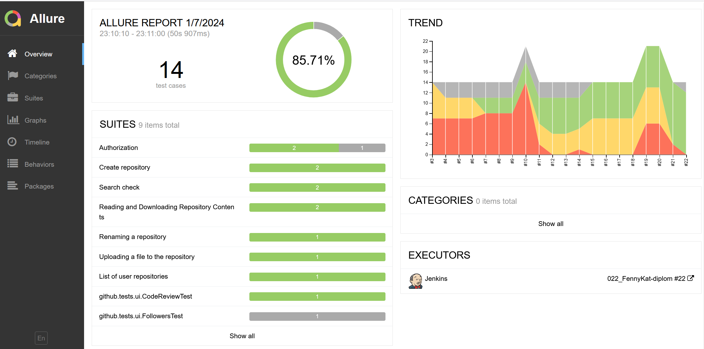
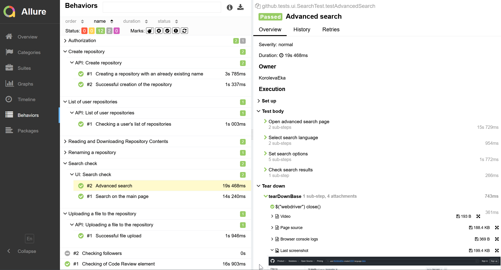
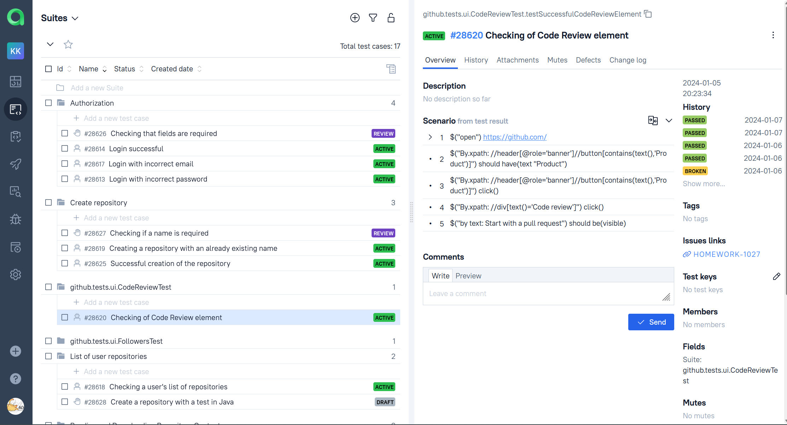
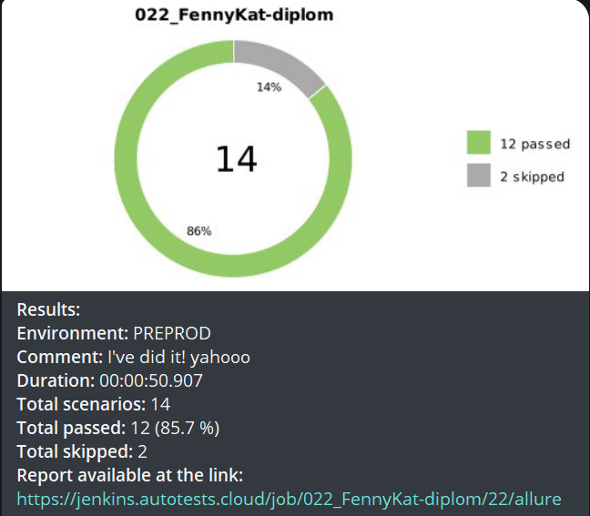

# Дипломный проект по автоматизации тестовых сценариев с использованием UI и API тестов для [GitHub](https://github.com/)
##  Содержание:

+ [Использованный стек технологий](#computer-использованный-стек-технологий)
+ [Запуск тестов из терминала](#arrow_forward-запуск-тестов-из-терминала)
+ [Сборка в Jenkins](#сборка-в-jenkins)
+ [Пример Allure-отчета](#пример-allure-отчета)
+ [Уведомления в Telegram с использованием бота](#уведомления-в-telegram-с-использованием-бота)
+ [Видео примера запуска тестов в Selenoid](#-видео-примера-запуска-теста-в-selenoid)

## :computer: Использованный стек технологий

<p align="center">
<a href="https://www.jetbrains.com/ru-ru/idea/"></a>
<a href="https://www.java.com/"></a>
<a href="https://selenide.org/"></a>
<a href="https://aerokube.com/selenoid/latest/"></a>
<a href="https://allurereport.org/"></a>
<a href="https://qameta.io/"></a>
<a href="https://gradle.org/"></a>
<a href="https://junit.org/junit5/docs/current/user-guide/"></a>
<a href="https://github.com/"></a>
<a href="https://www.jenkins.io/"></a>
<a href="https://web.telegram.org/"></a>
<a href="https://www.atlassian.com/ru/software/jira"></a>
<a href="https://rest-assured.io/"></a>
</p>

- В данном проекте автотесты написаны на языке <code>Java</code> с использованием фреймворка для тестирования Selenide.
- В качестве сборщика был использован - <code>Gradle</code>.
- Использованы фреймворки <code>JUnit 5</code> и [Selenide](https://selenide.org/).
- При прогоне тестов браузер запускается в [Selenoid](https://aerokube.com/selenoid/).
- Page Object шаблон проектирования.
- Использование библиотеки Owner для легкости конфигурации.
- Для удаленного запуска реализована сборка в <code>Jenkins</code> с формированием Allure-отчета и отправкой результатов в <code>Telegram</code> при помощи бота.
- Осуществлена интеграция с <code>Allure TestOps</code> и <code>Jira</code>
- Использование Lombok для моделей в API тестах.
- Использована спецификация для API-тестов.
- Применён allure rest-assured listener 

Содержание Allure-отчета:
* Шаги теста;
* Скриншот страницы на последнем шаге;
* Page Source;
* Логи браузерной консоли;
* Видео выполнения автотеста.

## :arrow_forward: Запуск автотестов

### Запуск тестов из терминала
```
gradle clean test
```
### Запуск тестов на удаленном браузере
```
gradle clean test -DisRemote=true
```
При необходимости также можно переопределить параметры запуска

```
clean
test
-DbaseUrl=${BASE_URL}
-DwebDriverHost=${WEB_DRIVER_HOST}
-DvideoHost=${VIDEO_HOST}
-Dbrowser=${BROWSER}
-Dversion=${VERSION}
-DbrowserSize=${BROWSER_SIZE}
```

### Параметры сборки
* <code>BASE_URL</code> – Url, по которому будет открываться тестируемое приложение.
* <code>WEBDRIVER_HOST</code> – адрес удаленного сервера, на котором будут запускаться тесты.
* <code>VIDEO_HOST</code> – адрес, где будут хранится записанные видео о прохождении тестов.
* <code>BROWSER</code> – браузер, в котором будут выполняться тесты. По-умолчанию - <code>chrome</code>.
* <code>VERSION</code> – версия браузера, в которой будут выполняться тесты. По-умолчанию - <code>100.0</code>.
* <code>BROWSER_SIZE</code> – размер окна браузера, в котором будут выполняться тесты.

##  Сборка в [Jenkins](https://jenkins.autotests.cloud/job/022_FennyKat-Jenkins-full-project/)
<p align="center">

</p>

##  Пример [Allure-отчета](https://jenkins.autotests.cloud/job/022_FennyKat-Jenkins-full-project/4/allure/)
### Overview

<p align="center">

</p>

### Результат выполнения теста

<p align="center">

</p>

##  Интеграция с [Allure TestOps](https://allure.autotests.cloud/project/3755/dashboards)

Выполнена интеграция сборки <code>Jenkins</code> с <code>Allure TestOps</code>.
Результат выполнения автотестов отображается в <code>Allure TestOps</code>.
На Dashboard в <code>Allure TestOps</code> отображена статистика пройденных тестов.

<p align="center">

</p>


<p align="center">

</p>

##  Интеграция с [Jira](https://jira.autotests.cloud/browse/HOMEWORK-934)

Реализована интеграция <code>Allure TestOps</code> с <code>Jira</code>, в тикете отображается информация, какие тест-кейсы были написаны в рамках задачи и результат их прогона.

<p align="center">

</p>

##  Уведомления в Telegram с использованием бота

После завершения сборки, бот созданный в <code>Telegram</code>, автоматически обрабатывает и отправляет сообщение с результатом.

<p align="center">

</p>

## Видео примера запуска тестов в Selenoid

К тестам в отчете прилагается видео прогона.

<p align="center">
  
</p>
